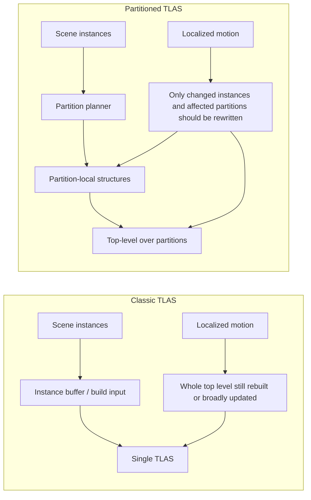
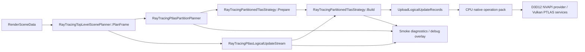

# PTLAS Stage 3 Visual Assets

Date: 2026-06-17
Status: Draft 1
Owner: Pawel + Codex
Article: `What Changes When an Engine Moves From TLAS to PTLAS`
Depends on:

- `notes/ptlas-article-design-doc.md`
- `notes/ptlas-article-creation-stages.md`
- `notes/ptlas-stage1-source-truth.md`
- `notes/ptlas-stage2-evidence-package.md`

## 1. Purpose

This document completes Stage 3 in draft form.

It defines the visual assets the article should use and drafts their structure so the final article can reuse them directly.

Stage 3 is not just "have some visuals".
It is:

- define what each visual says
- define what claim it supports
- make each visual specific to PTLAS and SparkleEngine

## 2. Stage 3 Goal

Create the diagrams and comparison tables that the article needs.

## 3. Stage 3 Deliverables

- BLAS / TLAS / PTLAS comparison table
- PTLAS update-model diagram
- Sparkle code-path / architecture diagram
- classic TLAS vs PTLAS evidence table

## 4. Stage 3 Exit Criteria

Stage 3 is complete when:

- visuals are specific enough to Sparkle and PTLAS
- visuals support the exact article claims
- no visual could be dropped into a random ray tracing article without revision

## 5. Visual Asset Principles

All visuals for this article should follow these rules:

- explain through contrast
- stay compact
- support a concrete section claim
- use Sparkle terminology where appropriate
- avoid generic “ray tracing pretty picture” filler

## 6. Deliverable 1: BLAS / TLAS / PTLAS Comparison Table

### Purpose

This is the baseline comparison figure.
It gives the reader the shortest path from familiar ray tracing structure concepts to the PTLAS delta.

### Best article location

- section 2 `Ray tracing structure overview`

### Claim it supports

- PTLAS is a top-level update-model change, not just another name for TLAS

### Draft table content

| Aspect | BLAS | Classic TLAS | PTLAS |
|---|---|---|---|
| Owns | Geometry acceleration data for one mesh or mesh group | Scene-level instances of BLAS objects | Scene-level instances organized into partitions |
| Primary role | Accelerate ray traversal through geometry | Accelerate ray traversal through scene instances | Preserve TLAS shader-facing role while changing how top-level updates are expressed |
| Typical changes across frames | Geometry changes, skinning, mesh rebuilds, LoD changes | Instance transforms, instance membership, scene composition | Instance transforms, partition membership, partition translation, selective top-level updates |
| Small localized motion cost | Usually local to changed geometry | Often still tied to rebuilding or refitting the whole top level | Intended to touch only changed instances and affected partitions |
| Shader-facing behavior | Geometry leaf input | Top-level traversal entry | Same top-level traversal role as TLAS |
| Key optimization question | When to rebuild vs update geometry | How much top-level work is re-done per frame | How selective the instance and partition update stream really is |
| What matters most for this article | BLAS is not the bottleneck we are solving here | The classic baseline Sparkle is moving from | The new model Sparkle is trying to realize behaviorally |

### Why this table works

- it starts from what the audience already knows
- it centers the article on differences
- it avoids a beginner-style glossary tone

### Optional stronger version

If the article needs a more engineering-heavy version, replace `Typical changes across frames` with:

- `Update granularity`
- `Persistent state`
- `What a localized change invalidates`

## 7. Deliverable 2: PTLAS Update-Model Diagram

### Purpose

This diagram explains the conceptual difference between classic TLAS updates and PTLAS updates.

### Best article location

- section 3 `What PTLAS changes conceptually`

### Claim it supports

- PTLAS value comes from selective top-level work, not from naming the feature

### Recommended diagram structure

Use a left-to-right comparison with two lanes.

#### Left lane: classic TLAS path

- scene instances
- top-level build input
- one classic TLAS
- small localized motion
- whole top level still rebuilt or broadly updated

#### Right lane: PTLAS path

- scene instances
- partition assignment
- partition-local structures
- top-level over partitions
- small localized motion
- only changed instances / affected partitions rewritten

### Suggested labels

Classic lane labels:

- `Instances`
- `Single top-level structure`
- `Localized motion still feeds a broad top-level rebuild path`

PTLAS lane labels:

- `Instances`
- `Partition planner`
- `Partition-local top-level work`
- `Top-level over partitions`
- `Only changed instances / affected partitions should be rewritten`

### Optional extra annotation

Add a highlighted side note:

`From shaders, both look like TLAS. The difference is in how top-level changes are expressed and rebuilt.`

### Mermaid-style draft



### Why this diagram works

- it teaches through contrast
- it reinforces the article thesis
- it is specific to update behavior, not generic RT education

## 8. Deliverable 3: Sparkle Code-Path / Architecture Diagram

### Purpose

This is the article’s most important Sparkle-specific systems figure.

### Best article location

- section 5 `SparkleEngine today`
- section 6 `The hard part`

### Claim it supports

- Sparkle already has real PTLAS planning and diagnostics
- the remaining gap is between logical updates and native selective PTLAS work

### Required nodes

- `RenderSceneData`
- `RayTracingTopLevelScenePlanner::PlanFrame`
- `RayTracingPtlasPartitionPlanner`
- `RayTracingPtlasLogicalUpdateStream`
- `RayTracingPartitionedTlasStrategy::Prepare`
- `RayTracingPartitionedTlasStrategy::Build`
- `UploadLogicalUpdateRecords`
- `CPU native operation pack`
- `D3D12 NVAPI provider / Vulkan PTLAS services`
- `Smoke diagnostics / debug overlay`

### Required emphasis

The diagram must visually distinguish:

- planning / logical update generation
- native operation construction
- backend build submission
- diagnostics export

### Most important annotation

Add a highlighted note at the native pack stage:

`Current gap: logical updates are selective, but the live native path still collapses into a full-scene write batch.`

### Mermaid-style draft



### Sparkle-specific annotations to include

- planner outputs packed debug visualization data
- logical update stream emits dirty / moved entries only
- strategy currently builds one full-scene native write pack
- diagnostics serialize provider, partitions, logical updates, native ops, and timings

### Why this diagram works

- it proves the article is about a real engine
- it clarifies where the architecture is already strong
- it makes the “last mile” problem visually obvious

## 9. Deliverable 4: Classic TLAS vs PTLAS Evidence Table

### Purpose

This is the proof table.
It ties the article’s claims to real captures and metrics.

### Best article location

- section 6 `The hard part`
- section 8 `What success looks like`

### Claim it supports

- current Sparkle PTLAS work already changes planning and visibility state
- but the hardest proof is in native update behavior and measurements

### Draft table structure

| Comparison axis | Classic TLAS capture | PTLAS capture | What the reader should infer |
|---|---|---|---|
| Top-level provider | `ClassicTlas` | `PartitionedTlas` when requested and supported | Sparkle already switches top-level strategy intentionally |
| PTLAS provider | `None` or inactive | `D3D12NvapiPartitionedTlas` or `VulkanNvPartitionedAccelerationStructure` | Backend-specific PTLAS path is real |
| Partition count | N/A | Non-zero | PTLAS planning is not hypothetical |
| Dirty transforms | May exist but do not imply partition model | Non-zero in PTLAS update captures | PTLAS planner tracks localized motion explicitly |
| Moved partitions | N/A | Non-zero when crossings happen | Sparkle tracks partition migration state |
| Logical updates | N/A | Non-zero | Selective logical PTLAS work is already computed |
| Native operations | Classic TLAS build path | PTLAS native op count | The critical question is whether native PTLAS work remains selective |
| Selected writer path | Classic path | `CpuPack` or other selected path | Sparkle already exposes writer-path policy and fallbacks |
| BLAS GPU ms | Measured | Measured | Useful context, but not the main PTLAS argument |
| Classic TLAS GPU ms | Measured | Still relevant as comparison baseline | PTLAS must justify itself relative to the classic path |
| PTLAS update GPU ms | N/A | Measured when PTLAS path is active | Article should connect this to update volume, not present it alone |

### How to use this table well

- fill it with actual bundle IDs once Stage 2 captures exist
- avoid making unsupported performance claims from empty rows

### Recommended article behavior

If Stage 2 yields stronger D3D12 evidence than Vulkan, be explicit.
Do not pretend parity if one backend has more mature proof than the other.

## 10. Optional Supporting Table: Vendor Terminology Map

### Purpose

Help readers align vendor language with Sparkle language quickly.

### Best article location

- section 4 `The vendor model`

### Draft table content

| Concept | Khronos / Vulkan | NVIDIA sample / NVAPI | Microsoft DXR spec | SparkleEngine |
|---|---|---|---|---|
| Partitioned top-level structure | `VK_NV_partitioned_acceleration_structure` | Partitioned TLAS | Partitioned TLAS / PTLAS | `PartitionedTlas` top-level provider |
| Write instance op | `WRITE_INSTANCE` | PTLAS write instance operation | Partitioned TLAS write instance | Native operation header `WriteInstance` |
| Update instance op | `UPDATE_INSTANCE` | PTLAS update instance operation | Partitioned TLAS update instance | Planned/native op concept |
| Partition translation | `WRITE_PARTITION_TRANSLATION` | Partition translation flag / op | Translate partitions | Present in model, not the main first-article focus |
| Global partition | Global partition concept | Global partition support | Global partition concept | `GlobalPartition` planner/update state |
| Logical dirty state | App-defined | Moving instances in sample | Indirect operation arguments | `RayTracingPtlasLogicalUpdateStream` |

This table is optional but likely useful.

## 11. Optional Supporting Diagram: Current Gap Callout

### Purpose

Make the article’s hardest point instantly understandable.

### Simple format

```
Selective logical updates: yes
Selective native PTLAS rebuilds: not yet fully realized
```

### Better version

Two stacked boxes:

- top:
  `Planner / logical updates already selective`
- bottom:
  `Current live native path still repacks full-scene writes`

This is not mandatory, but it would make section 6 very strong.

## 12. Visual-to-Claim Map

### BLAS / TLAS / PTLAS comparison table

Supports:

- PTLAS is a top-level model change

### PTLAS update-model diagram

Supports:

- PTLAS value depends on selective top-level work

### Sparkle architecture diagram

Supports:

- Sparkle already has meaningful PTLAS-specific architecture

### Classic vs PTLAS evidence table

Supports:

- the article is grounded in observed engine behavior

## 13. Specificity Check

Before finalizing Stage 3, ask:

- does this visual include Sparkle-specific naming where it should?
- does this visual emphasize the logical-vs-native gap clearly enough?
- could this visual appear unchanged in a generic PTLAS blog post?

If the answer to the last question is yes, it is still too generic.

## 14. Status

Current status:

- BLAS / TLAS / PTLAS comparison table: drafted
- PTLAS update-model diagram: drafted
- Sparkle code-path / architecture diagram: drafted
- classic TLAS vs PTLAS evidence table: drafted

## 15. Next Step

Stage 3 is now drafted conceptually.

The best next step is Stage 4:

- turn these assets into the article skeleton
- place each visual against its target section
- decide which visuals are mandatory in the first article draft and which are optional
