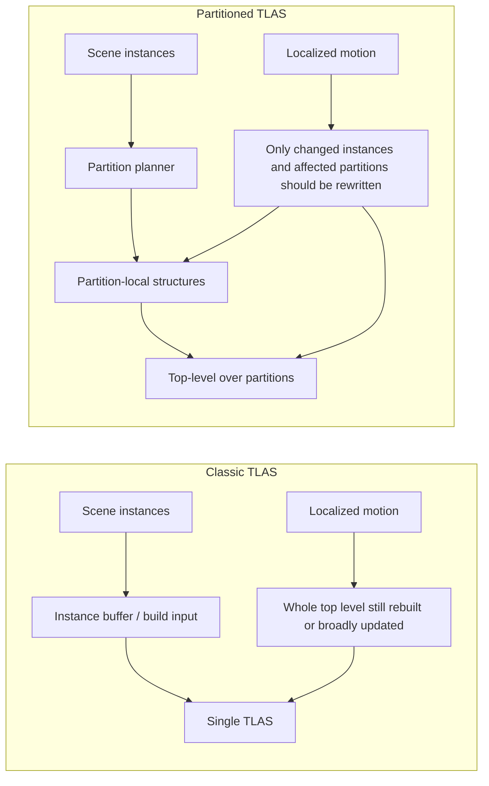
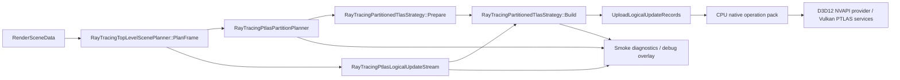

# PTLAS Stage 3 Visual Assets

Date: 2026-06-17
Status: Draft 1
Owner: Pawel + Codex
Article: `Next Gen RT Acceleration Structure: PTLAS vs TLAS`
Depends on:

- `notes/ptlas-article-design-doc.md`
- `notes/ptlas-article-creation-stages.md`
- `notes/ptlas-stage1-source-truth.md`
- `notes/ptlas-stage2-evidence-package.md`

## 1. Purpose

This document completes Stage 3 in draft form.

It defines the visual assets the article should use and drafts their structure so the final article can reuse them directly.

Stage 3 is not just "have some visuals".
It is:

- define what each visual says
- define what claim it supports
- make each visual specific to PTLAS and SparkleEngine

## 2. Stage 3 Goal

Create the diagrams and comparison tables that the article needs.

## 3. Stage 3 Deliverables

- BLAS / TLAS / PTLAS comparison table
- PTLAS update-model diagram
- Sparkle code-path / architecture diagram
- classic TLAS vs PTLAS evidence table

## 4. Stage 3 Exit Criteria

Stage 3 is complete when:

- visuals are specific enough to Sparkle and PTLAS
- visuals support the exact article claims
- no visual could be dropped into a random ray tracing article without revision

## 5. Visual Asset Principles

All visuals for this article should follow these rules:

- explain through contrast
- stay compact
- support a concrete section claim
- use Sparkle terminology where appropriate
- avoid generic "ray tracing pretty picture" filler

### 5.A Visual Contract For The Live Article

Every visual in the live article must answer one reader question.

If the visual does not answer a distinct question, remove it from the article and keep it only as a future asset candidate.

Current live visual contract:

| Visual | Reader question it answers | Keep? |
|---|---|---|
| `rt-as-baseline.html` | What does BLAS own, and what does TLAS own? | Yes |
| `rt-as-update-modes.html` | What is the classic rebuild vs update/refit tradeoff? | Yes |
| `ptlas-structure-slide.html` | What is PTLAS structurally? | Yes |
| `interactive-ptlas-domino-field.html` | What behavior do we want: broad world, local hot update region? | Yes |
| `ptlas-partition-policy.html` | Which update policy should moving instances use: local partition, global partition, or hybrid? | Yes |
| `ptlas-cpu-gpu-split.html` | Who prepares update data and who executes native PTLAS work? | Yes |
| Sparkle architecture Mermaid | Where can Sparkle preserve or lose selectivity? | Yes |
| `interactive-ptlas-compare.html` | Redundant with baseline + problem statement in current draft | Not in live article |
| `interactive-ptlas-movement.html` | Redundant with domino field + CPU/GPU split in current draft | Not in live article |

Caption rule:

- introduce each visual before it appears
- the introduction should say how to read it, not apologize for it
- avoid meta phrasing such as "this visual has one job" in the final article
- prefer reader-facing phrasing such as `Read this figure as...`

Simplicity rule:

- no more than one major visual should appear before the reader knows why they need it
- do not stack multiple visuals to prove the same idea
- a table counts as a visual if it is doing explanatory work
- avoid legends, metric cards, overlay labels, and caption blocks unless they remove more confusion than they add
- prefer one sentence before a visual and one sentence after it over surrounding it with explanatory scaffolding

## 5.0 Required Opening Baseline: BLAS / TLAS Update Vocabulary

Before the PTLAS structure slide, the article should show two bite-size classic acceleration-structure visuals.

Purpose:

- establish BLAS and TLAS ownership before PTLAS appears
- give update/refit and rebuild their own focused explanation
- make the TLAS vs PTLAS contrast understandable without requiring readers to reconstruct the baseline from memory
- keep the later PTLAS explanation focused on the delta rather than backfilling terminology

Required contents for `rt-as-baseline.html`:

- BLAS as geometry acceleration
- TLAS as instance acceleration
- instance records as transform + BLAS reference

Required contents for `rt-as-update-modes.html`:

- update/refit as preserving the existing structure shape where possible
- rebuild as reconstructing the structure more fully
- the tradeoff: update/refit can reduce build work, rebuild can preserve structure quality
- the limit: neither choice makes classic TLAS partition-local

Current live implementation:

- `layouts/shortcodes/rt-as-baseline.html`
- `layouts/shortcodes/rt-as-update-modes.html`
- article placement: immediately after `First, The Classic TLAS Baseline`

Style requirements:

- technical and compact
- no beginner-friendly cartoon treatment
- explicitly label this as the comparison point for PTLAS
- one reader question per visual

## 5.1 Required Opening Slide: PTLAS Structure Overview

The article should start with a clean PTLAS structure slide before the animated domino field.

Purpose:

- establish what PTLAS is structurally before showing why it matters dynamically
- give the audience a shared reference for partitions, instance-index pool, indirect operations, BLAS reuse, and the global partition
- make the rest of the article easier to narrate because we can point back to one stable diagram

Required contents:

- title: `Partitioned Top Level Acceleration Structure`
- left side: compact rules of the model
- right side: structure diagram showing geometry BLAS references, instance records, partitions, optional global partition, and the top-level structure
- explicit note that PTLAS changes top-level maintenance, not shader-facing traversal intent

Current live implementation:

- `layouts/shortcodes/ptlas-structure-slide.html`
- article placement: immediately after the thesis intro and before `Read The Picture First`

Important label rule:

- do not use `BLAS payload`
- use `Geometry BLAS`, `BLAS reference`, or `instance records: transform + partition index + BLAS reference`

Style requirements:

- modern technical-slide look
- elegant and readable, not toy-like
- avoid excessive color; use blue for structure and green only for the update-model cue
- preserve enough resemblance to vendor PTLAS diagrams that rendering engineers immediately recognize the model
- keep this asset structure-only; do not add CPU/GPU responsibilities here

## 5.1.1 Separate CPU / GPU Responsibility Split

The CPU/GPU responsibility split should be a separate visual, not part of the opening structure slide.

Reason:

- the opening slide should answer "what is PTLAS structurally?"
- the responsibility split should answer "who prepares and executes the update work?"
- combining both made the opening visual too dense and harder to narrate

Current live implementation:

- `layouts/shortcodes/ptlas-cpu-gpu-split.html`
- article placement: after the conceptual PTLAS update-model claim, before the movement widget

Responsibility split to show:

- CPU / engine policy:
  feature detection, backend selection, partition scheme, sizing, persistent PTLAS buffers, descriptor setup, command recording, and synchronization policy
- CPU or GPU:
  changed-instance detection, partition assignment, local-vs-global partition policy for dynamic objects, sparse write-record generation, and indirect operation-count updates
- GPU / native execution:
  optional compute-side sparse update generation, compacting changed records, incrementing operation counts, executing the PTLAS build/update command, and tracing through the resulting top-level structure

Important nuance:

- PTLAS is often described as GPU-driven because per-frame operation data can be generated and consumed on the device without host synchronization
- that does not mean the CPU disappears
- the clean mental model is CPU-managed setup plus optional CPU/GPU sparse-update preparation plus GPU-executed native build/update work

## 5.2 Reference Visual Direction

One especially strong PTLAS visual pattern is the wide aerial partition-field view used in vendor samples:

- a large scene seen from above or at a shallow angle
- partitions visible as large colored ground tiles
- only touched or updated regions saturated strongly
- moving objects or movement trails visible on top of the partition field
- the image explaining update locality before the reader reads the caption

Why this matters:

- it makes the PTLAS value obvious immediately
- it shows spatial locality instead of only talking about it
- it scales better for presentation and narration than a close-up debug crop

For this article, at least one major Sparkle visual should aim for this exact feel:

- wide camera
- partition coloring
- clear active update region
- visible object motion or movement trail
- enough contrast that a reader can say "only this area is hot" in one glance

### 5.3 Live partition-locality visual rule

The first PTLAS locality visual must be understandable before the reader knows the API details.

Required visible state:

- large partitioned board
- local moving/toppling set
- saturated PTLAS update cells

Avoid:

- starting with abstract policy names such as "global partition" before the reader understands the scene
- tiny active regions that disappear inside the perspective view
- excessive sky or empty canvas space
- metric cards that clip or become the main thing the reader notices
- labels that require the reader to already understand PTLAS terminology
- extra step controls when one strong state teaches the point better

Preferred widget behavior:

- make the board fill most of the frame
- keep domino paths visible even when no update is active
- use bright moving-instance markers during playback
- use saturated magenta or similarly unmistakable color only for updated partitions
- include a short caption that says exactly what the current state proves
- keep only replay control unless another interaction teaches a distinct behavior

Current live article implementation:

- `layouts/shortcodes/interactive-ptlas-domino-field.html`
- article placement: immediately after `Read The Picture First`
- purpose: make the NVIDIA-style "broad world, local update" model obvious before the article enters implementation architecture

### 5.4 Domino Sample Policy Tradeoff

The domino field should be followed by one compact policy visual.

Purpose:

- show that PTLAS is a policy space, not one automatic update behavior
- explain why a dynamic instance may either remain in its local partition or move to the global partition
- make the trace-performance vs update-performance tradeoff explicit

Current live implementation:

- `layouts/shortcodes/ptlas-partition-policy.html`
- article placement: immediately after `interactive-ptlas-domino-field.html`

Required modes:

- `Update local partition`
  - instance remains in its original partition
  - best trace performance
  - update may be expensive when the partition contains many instances
- `Move dynamic to global`
  - moving instances go to the global partition, then return when stable
  - faster update behavior
  - slightly worse trace performance because spatial coherence is weaker
- `Hybrid by distance`
  - nearby partitions stay local
  - far partitions route movers to global
  - `mode change distance` is the threshold that decides where the behavior flips

Narration line:

`local partition update = slower updates, cleaner tracing; global partition = faster updates, less spatial coherence; hybrid chooses where that tradeoff changes`

Additional sample behavior to mention outside the main cards:

- `Mark all dominoes dynamic in partition` is an aggressive global-partition variant
- when one domino in a partition topples, the whole partition's domino set can be routed through global
- this can reduce local partition rewrites
- it can also grow the global partition beyond the truly moving set

### 5.5 NVIDIA Domino Demo Evidence Block

The article should not treat the NVIDIA demo as only a reference image.
It should be used as a compact evidence block that teaches the full sample loop.

Required article facts:

- about 170k dynamic dominoes
- about 1.2M static board objects
- uniform 2D partition grid
- saturated ground cells are partitions updated by the moving wave
- domino colors show partition ownership
- PTLAS Active switches the sample to partitioned top-level maintenance
- the UI exposes updated-instance count plus TLAS/PTLAS memory and scratch sizes
- the profiler separates physics, sparse instance-update generation, and top-level update work

Source-level behavior to explain:

- physics compute updates domino state and marks partition timestamps
- policy chooses local partition update or global partition movement
- moving to or from global marks source and destination partition index lists for rewrite
- instance-update compute atomically increments the PTLAS write-instance operation argument count
- each changed domino writes one updated PTLAS instance record
- the host submits `vkCmdBuildPartitionedAccelerationStructuresNV` with device-side operation buffers

Reader question answered:

`How does a visible moving wave become a sparse PTLAS update instead of a broad TLAS-style update?`

Placement:

- after the PTLAS structure overview
- before CPU/GPU responsibility split or immediately before the sparse-work pipeline

## 6. Deliverable 1: BLAS / TLAS / PTLAS Comparison Table

### Purpose

This is the baseline comparison figure.
It gives the reader the shortest path from familiar ray tracing structure concepts to the PTLAS delta.

### Best article location

- section 2 `Ray tracing structure overview`

### Claim it supports

- PTLAS is a top-level update-model change, not just another name for TLAS

### Draft table content

| Aspect | BLAS | Classic TLAS | PTLAS |
|---|---|---|---|
| Owns | Geometry acceleration data for one mesh or mesh group | Scene-level instances of BLAS objects | Scene-level instances organized into partitions |
| Primary role | Accelerate ray traversal through geometry | Accelerate ray traversal through scene instances | Preserve TLAS shader-facing role while changing how top-level updates are expressed |
| Typical changes across frames | Geometry changes, skinning, mesh rebuilds, LoD changes | Instance transforms, instance membership, scene composition | Instance transforms, partition membership, partition translation, selective top-level updates |
| Small localized motion cost | Usually local to changed geometry | Often still tied to rebuilding or refitting the whole top level | Intended to touch only changed instances and affected partitions |
| Shader-facing behavior | Geometry leaf input | Top-level traversal entry | Same top-level traversal role as TLAS |
| Key optimization question | When to rebuild vs update geometry | How much top-level work is re-done per frame | How selective the instance and partition update stream really is |
| What matters most for this article | BLAS is not the bottleneck we are solving here | The classic baseline Sparkle is moving from | The new model Sparkle is trying to realize behaviorally |

### Why this table works

- it starts from what the audience already knows
- it centers the article on differences
- it avoids a beginner-style glossary tone

### Optional stronger version

If the article needs a more engineering-heavy version, replace `Typical changes across frames` with:

- `Update granularity`
- `Persistent state`
- `What a localized change invalidates`

## 7. Deliverable 2: PTLAS Update-Model Diagram

### Purpose

This diagram explains the conceptual difference between classic TLAS updates and PTLAS updates.

### Best article location

- section 3 `What PTLAS changes conceptually`

### Claim it supports

- PTLAS value comes from selective top-level work, not from naming the feature

### Recommended diagram structure

Use a left-to-right comparison with two lanes.

#### Left lane: classic TLAS path

- scene instances
- top-level build input
- one classic TLAS
- small localized motion
- whole top level still rebuilt or broadly updated

#### Right lane: PTLAS path

- scene instances
- partition assignment
- partition-local structures
- top-level over partitions
- small localized motion
- only changed instances / affected partitions rewritten

### Suggested labels

Classic lane labels:

- `Instances`
- `Single top-level structure`
- `Localized motion still feeds a broad top-level rebuild path`

PTLAS lane labels:

- `Instances`
- `Partition planner`
- `Partition-local top-level work`
- `Top-level over partitions`
- `Only changed instances / affected partitions should be rewritten`

### Optional extra annotation

Add a highlighted side note:

`From shaders, both look like TLAS. The difference is in how top-level changes are expressed and rebuilt.`

### Mermaid-style draft



### Why this diagram works

- it teaches through contrast
- it reinforces the article thesis
- it is specific to update behavior, not generic RT education

### Companion real-scene visual

This diagram should ideally be paired with one strong Sparkle capture that has the same explanatory effect as the wide NVIDIA-style PTLAS partition visualization:

- large tiled partition field
- one localized active region
- moving objects or movement trail over the field
- visually obvious "broad world, local update"

## 8. Deliverable 3: Sparkle Code-Path / Architecture Diagram

### Purpose

This is the article's most important Sparkle-specific systems figure.

### Best article location

- section 5 `SparkleEngine today`
- section 6 `The hard part`

### Claim it supports

- Sparkle already has real PTLAS planning and diagnostics
- the remaining gap is between logical updates and native selective PTLAS work

### Required nodes

- `RenderSceneData`
- `RayTracingTopLevelScenePlanner::PlanFrame`
- `RayTracingPtlasPartitionPlanner`
- `RayTracingPtlasLogicalUpdateStream`
- `RayTracingPartitionedTlasStrategy::Prepare`
- `RayTracingPartitionedTlasStrategy::Build`
- `UploadLogicalUpdateRecords`
- `CPU native operation pack`
- `D3D12 NVAPI provider / Vulkan PTLAS services`
- `Smoke diagnostics / debug overlay`

### Required emphasis

The diagram must visually distinguish:

- planning / logical update generation
- native operation construction
- backend build submission
- diagnostics export

### Most important annotation

Add a highlighted note at the native pack stage:

`Current gap: logical updates are selective, but the live native path still collapses into a full-scene write batch.`

### Mermaid-style draft



### Sparkle-specific annotations to include

- planner outputs packed debug visualization data
- logical update stream emits dirty / moved entries only
- strategy currently builds one full-scene native write pack
- diagnostics serialize provider, partitions, logical updates, native ops, and timings

### Why this diagram works

- it proves the article is about a real engine
- it clarifies where the architecture is already strong
- it makes the "last mile" problem visually obvious

## 9. Deliverable 4: Classic TLAS vs PTLAS Evidence Table

### Purpose

This is the proof table.
It ties the article's claims to real captures and metrics.

### Best article location

- section 6 `The hard part`
- section 8 `What success looks like`

### Claim it supports

- current Sparkle PTLAS work already changes planning and visibility state
- but the hardest proof is in native update behavior and measurements

### Draft table structure

| Comparison axis | Classic TLAS capture | PTLAS capture | What the reader should infer |
|---|---|---|---|
| Top-level provider | `ClassicTlas` | `PartitionedTlas` when requested and supported | Sparkle already switches top-level strategy intentionally |
| PTLAS provider | `None` or inactive | `D3D12NvapiPartitionedTlas` or `VulkanNvPartitionedAccelerationStructure` | Backend-specific PTLAS path is real |
| Partition count | N/A | Non-zero | PTLAS planning is not hypothetical |
| Dirty transforms | May exist but do not imply partition model | Non-zero in PTLAS update captures | PTLAS planner tracks localized motion explicitly |
| Moved partitions | N/A | Non-zero when crossings happen | Sparkle tracks partition migration state |
| Logical updates | N/A | Non-zero | Selective logical PTLAS work is already computed |
| Native operations | Classic TLAS build path | PTLAS native op count | The critical question is whether native PTLAS work remains selective |
| Selected writer path | Classic path | `CpuPack` or other selected path | Sparkle already exposes writer-path policy and fallbacks |
| BLAS GPU ms | Measured | Measured | Useful context, but not the main PTLAS argument |
| Classic TLAS GPU ms | Measured | Still relevant as comparison baseline | PTLAS must justify itself relative to the classic path |
| PTLAS update GPU ms | N/A | Measured when PTLAS path is active | Article should connect this to update volume, not present it alone |

### How to use this table well

- fill it with actual bundle IDs once Stage 2 captures exist
- avoid making unsupported performance claims from empty rows

### Recommended article behavior

If Stage 2 yields stronger D3D12 evidence than Vulkan, be explicit.
Do not pretend parity if one backend has more mature proof than the other.

### Strong visual pairing

This evidence table becomes much stronger if one of the adjacent images is a wide partition-field screenshot rather than only a close-up debug visualization.

Best pairing:

- wide partition-field image for intuition
- evidence table for proof

## 10. Optional Supporting Table: Vendor Terminology Map

### Purpose

Help readers align vendor language with Sparkle language quickly.

### Best article location

- section 4 `The vendor model`

### Draft table content

| Concept | Khronos / Vulkan | NVIDIA sample / NVAPI | Microsoft DXR spec | SparkleEngine |
|---|---|---|---|---|
| Partitioned top-level structure | `VK_NV_partitioned_acceleration_structure` | Partitioned TLAS | Partitioned TLAS / PTLAS | `PartitionedTlas` top-level provider |
| Write instance op | `WRITE_INSTANCE` | PTLAS write instance operation | Partitioned TLAS write instance | Native operation header `WriteInstance` |
| Update instance op | `UPDATE_INSTANCE` | PTLAS update instance operation | Partitioned TLAS update instance | Planned/native op concept |
| Partition translation | `WRITE_PARTITION_TRANSLATION` | Partition translation flag / op | Translate partitions | Present in model, not the main first-article focus |
| Global partition | Global partition concept | Global partition support | Global partition concept | `GlobalPartition` planner/update state |
| Logical dirty state | App-defined | Moving instances in sample | Indirect operation arguments | `RayTracingPtlasLogicalUpdateStream` |

This table is optional but likely useful.

## 11. Optional Supporting Diagram: Current Gap Callout

### Purpose

Make the article's hardest point instantly understandable.

### Simple format

```
Selective logical updates: yes
Selective native PTLAS rebuilds: not yet fully realized
```

### Better version

Two stacked boxes:

- top:
  `Planner / logical updates already selective`
- bottom:
  `Current live native path still repacks full-scene writes`

This is not mandatory, but it would make section 6 very strong.

## 12. Visual-to-Claim Map

### BLAS / TLAS / PTLAS comparison table

Supports:

- PTLAS is a top-level model change

### PTLAS update-model diagram

Supports:

- PTLAS value depends on selective top-level work

### Sparkle architecture diagram

Supports:

- Sparkle already has meaningful PTLAS-specific architecture

### Classic vs PTLAS evidence table

Supports:

- the article is grounded in observed engine behavior

## 13. Specificity Check

Before finalizing Stage 3, ask:

- does this visual include Sparkle-specific naming where it should?
- does this visual emphasize the logical-vs-native gap clearly enough?
- could this visual appear unchanged in a generic PTLAS blog post?

If the answer to the last question is yes, it is still too generic.

## 14. Status

Current status:

- BLAS / TLAS / PTLAS comparison table: drafted
- PTLAS update-model diagram: drafted
- Sparkle code-path / architecture diagram: drafted
- classic TLAS vs PTLAS evidence table: drafted

## 15. Next Step

Stage 3 is now drafted conceptually.

The best next step is Stage 4:

- turn these assets into the article skeleton
- place each visual against its target section
- decide which visuals are mandatory in the first article draft and which are optional
